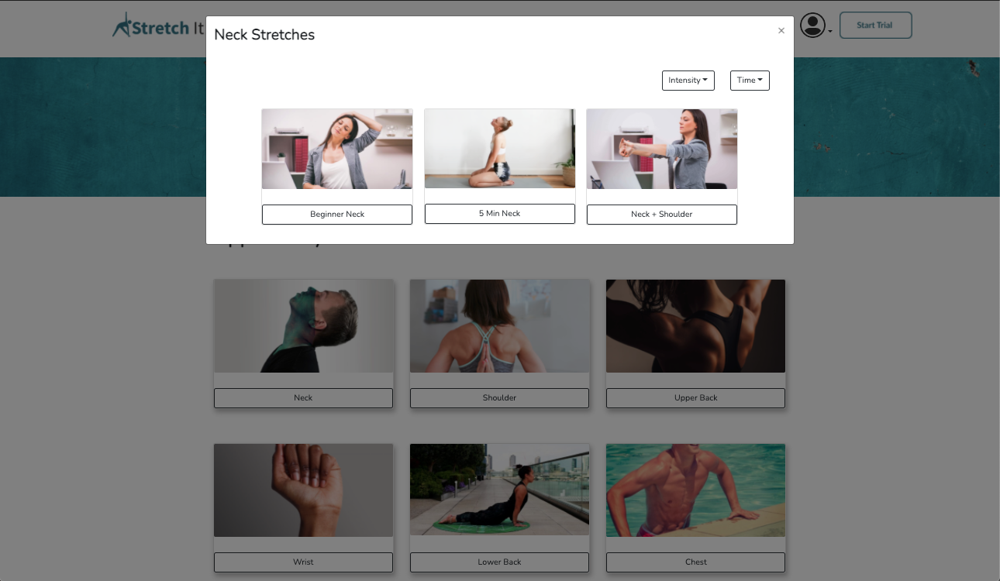
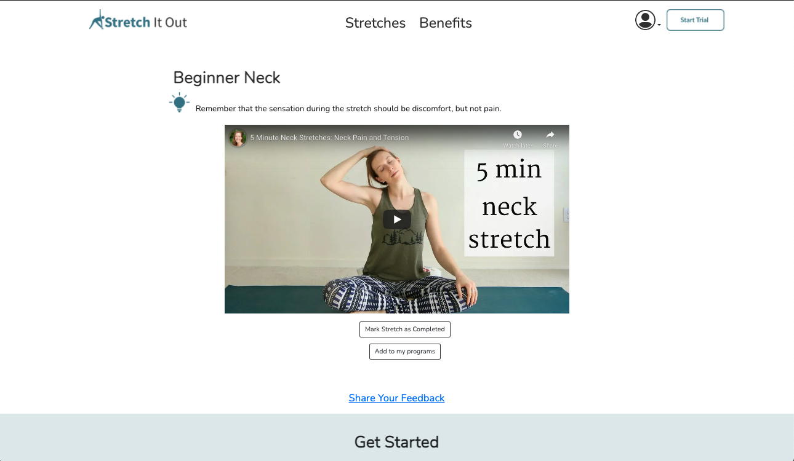
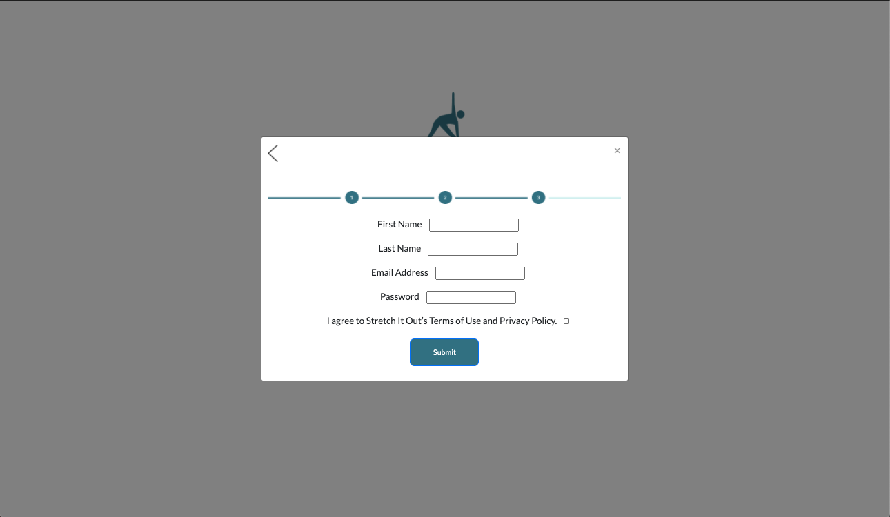
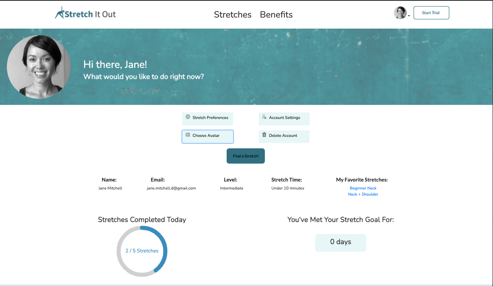

# Stretch It Out

Hello, Welcome to Stretch It Out!

# What is this App?

Stretch-It-Out.heroku.com is an app focused on providing a new, intuitive, meaningful, and accessible way for anyone to implement healthy life choices. Users can create customized stretching routines that cater to their needs and comfort level.

# Status

This project has a status of complete, but there is room for expansion.

# Demo

# Why

This project was developed for the busy individual who feels that they have little-to-no time to get in better shape. As developers, we know how working at a computer all day can cause many physical ailments, such as poor posture, limited mobility, and diminished overall health. We built this app because we know that our health, both physical and mental, is the key to our success.

# Our Team

Eric Anderson : https://github.com/ericshuanders

Laurel Galaty : https://github.com/ljgalaty

Love James : https://github.com/Lovj-web

Marlon Angulo : https://github.com/junior033

# How

### Dependencies:

#### Client:

"bootstrap": "^4.5.3",

"react": "^16.14.0",

"react-bootstrap": "^1.4.0",

"react-circular-progressbar": "^2.0.3",

"react-dom": "^16.14.0",

"react-items-carousel": "^2.8.0",

"react-router-dom": "^5.2.0",

"react-scripts": "3.4.3",

"sweetalert": "^2.1.2",

"validator": "^13.1.17"

#### Server:

"axios": "^0.21.0",

"bcryptjs": "^2.4.3",

"cloudinary": "^1.23.0",

"concurrently": "^5.3.0",

"cookie-parser": "^1.4.5",

"express": "^4.17.1",

"express-fileupload": "^1.2.0",

"jsonwebtoken": "^8.5.1",

"mongodb": "^3.6.2",

"mongoose": "^5.10.9",

"passport": "^0.4.1",

"passport-jwt": "^4.0.0",

"react-circular-progressbar": "^2.0.3",

"sweetalert": "^2.1.2"

- To add these dependencies, run yarn add "dependency name"

## API Endpoints

- Create User Account: /api/ (POST)

- Login User: /api/login (POST)

- Logout User: /api/user/logout (POST)

- Update User: /api/user/update (PUT)

- Upload Avatar: /api/user/avatar (POST)

- Fetch Current User: /api/user/me (GET)

- Increment Stretch Goal: /api/user/increment (PUT)

- Fetch Selected Stretch: /api/stretch/:id (GET)

- Fetch Stretches by Body Area: /api/stretches/:bodyArea (GET)

# Try it out Yourself!

## Setup

- `git clone` this repo

- `cd` into it.

- `yarn install`

- `cd client && yarn install`

- `cp .env.sample .env`

## Available build commands

- `yarn dev`: Runs BOTH your Express.JS and React developer environment locally at the same time. Any logs coming from Express will be prefaced with `[0]`, any logs from `create-react-app` will be prefaced with `[1]`.

- `yarn server`: Runs JUST your Express.JS server.

- `yarn client`: Runs JUST your front-end React app.

Open [http://localhost:3000](http://localhost:3000) to view your local React app in the browser. The page will reload if you make edits.
